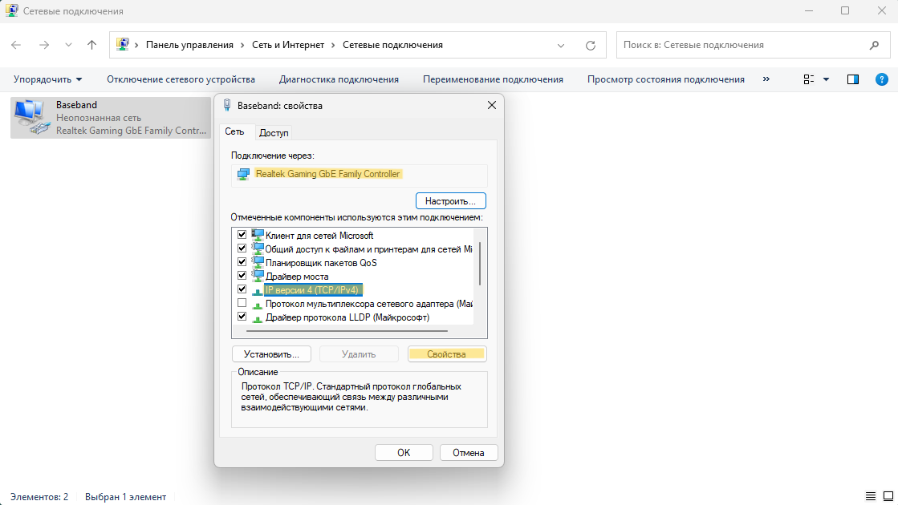
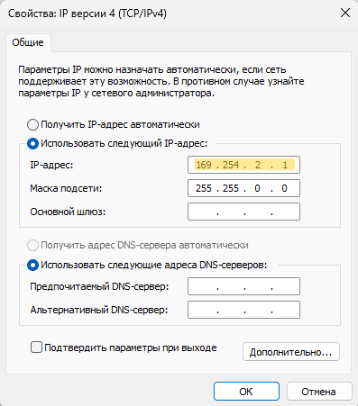
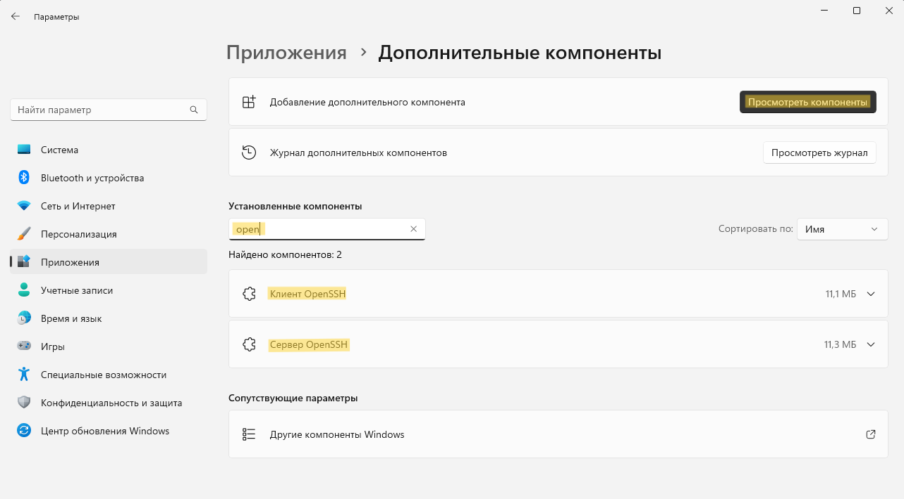
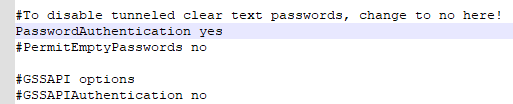
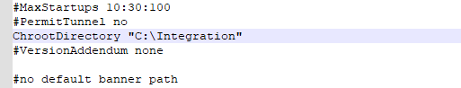
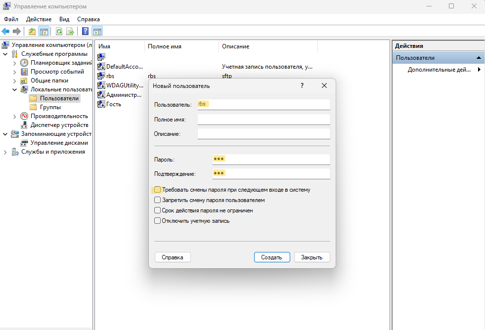
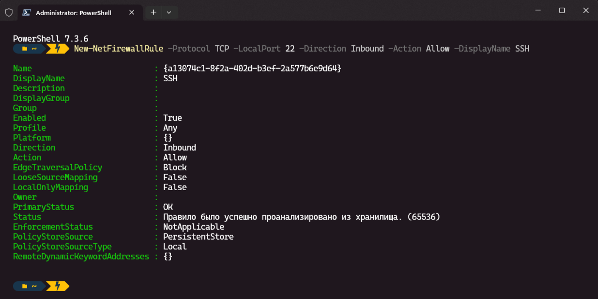
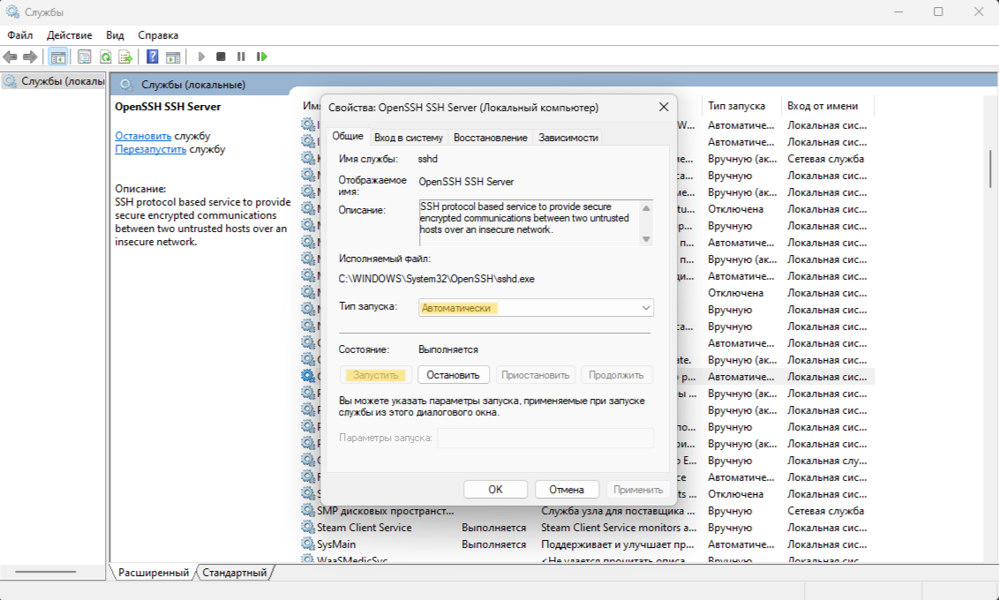

Эта инструкция позволяет настроить SFTP-сервер на Windows для Baseband, без стороннего ПО, который будет работать перманентно и не будет требовать вашего внимания.

Инструкция написана для Windows 11. На других ОС, путь до определённых функций или интерфейс, может немного отличатся.

## Оглавление
1. [Cтатичный IP](#cтатичный-ip)
2. [Установка Open SSH](#установка-open-ssh)
3. [Конфигурация Open SSH](#конфигурация-open-ssh)
4. [Новый пользователь](#новый-пользователь)
5. [Firewall](#firewall)
6. [Запуск Open SSH](#запуск-open-ssh)
7. [Опционально](#опционально)

## Cтатичный IP
Переходим в __Сетевые подключения__ (сочетание клавиш `⊞ Win`+`R`, вставляем __ncpa.cpl__, нажимаем __OK__).

Переходим в свойства сетевого адаптера, вашей материнской платы и, стандартно, меняем __IP версии 4 (TCP/IPv4)__ на __169.254.2.1__:





Прожимаем __ОК__, выходим.

## Установка Open SSH
Проверяем установку __Клиент OpenSSH__ и __Сервер OpenSSH__ через: `Параметры > Приложения > Дополнительные компоненты`.



Если компоненты отсутствуют, там же, тыкаем __Просмотреть компоненты__, ищем и устанавливаем.

## Конфигурация Open SSH
Находим в проводнике папку __ssh__: `C:\ProgramData\ssh`. И открываем файл __sshd_config__, от имени Администратора, любым текстовым редактором.
Находим строку __PasswordAuthentication yes__ и снимаем с неё комментирование _(удаляем символ #)_.



Находим строку __ChrootDirectory__, снимаем с неё комментирование и прописываем путь до папки, на которую хотим выдать доступ.



Сохраняем файл и закрываем.

## Новый пользователь
Переходим в __Управление компьютером__ (сочетание клавиш `⊞ Win`+`R`, вставляем __compmgmt.msc__, нажимаем __OK__).
Создаём нового пользователя в каталоге `Локальные пользователи > Пользователи`, через правую кнопку мыши.



Назначаем ему логин __rbs__, пароль __rbs__. Снимаем галочку с __Требовать смены пароля при следующем входе в систему__ и нажимаем __Создать__.
> [!IMPORTANT]
Через некоторое время, заданный нами пароль перестанет работать. Поэтому необходимо установить галочку на __Срок действия пароля не ограничен__.

> [!NOTE]
> Чтобы пользователь отобразился в списке, необходимо обновить страницу.

## Firewall
Запускаем командную строку от имени Администратора (сочетание клавиш `⊞ Win`+`X`, приложение будет в открывшемся списке).
Вставляем и применяем команду: 
```
New-NetFirewallRule -Protocol TCP -LocalPort 22 -Direction Inbound -Action Allow -DisplayName SSH
``` 
Тем самым открываем 22 порт для входящего трафика в нашем Firewall. 



## Запуск Open SSH
Переходим в __Службы__ (сочетание клавиш `⊞ Win`+`R`, вставляем __services.msc__, нажимаем __OK__).
В списке находим службу __OpenSSH SSH Server__ и открываем её.



Устанавливаем тип запуска __Автоматически__, нажимаем __Запустить__ и __ОК__.
> [!NOTE]
> Если на момент открытия службы, она уже была запущена, то её необходимо остановить и снова запустить, для того, чтобы применились изменения, которые мы внесли в __sshd_config__.

Теперь, всё готово к работе. SFTP-сервер будет автоматически запускаться при загрузке ОС.

## Опционально
После запуска ПК, в окне приветствия, будет отображаться, новый, созданный нами ранее пользователь - __rbs__. Его визуальное отображение можно отключить.

Запускаем командную строку от имени Администратора (сочетание клавиш `⊞ Win`+`X`, приложение будет в открывшемся списке).
Вставляем и применяем команду: 
```
reg add "HKLM\SOFTWARE\Microsoft\Windows NT\CurrentVersion\Winlogon\SpecialAccounts\UserList" /t REG_DWORD /f /d 0 /v rbs
```
Она создаст файл в реестре, который визуально скроет пользователя __rbs__, но при этом учётная запись останется активной, для того, чтобы работал поднятый нами SFTP-сервер.
Чтобы отменить это действие необходимо вставить и применить следующую команду:
```
reg add "HKLM\SOFTWARE\Microsoft\Windows NT\CurrentVersion\Winlogon\SpecialAccounts\UserList" /t REG_DWORD /f /d 1 /v rbs
```
